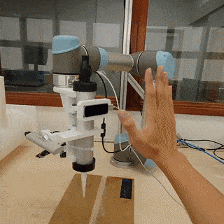

# Robotic Welding Human-Robot Interaction

## Requirements

- Leap Motion SDK & Drivers
  - https://developer-archive.leapmotion.com/v2
  - the ./lib in this repo specifies windows drivers, please add your own if running Linux/Mac
- Custom URX Python Package from https://github.com/jkur/python-urx/tree/SW3.5/urx
  - Because the one from pip is not updated :(
- Python 2.7
- python-tk
  - `sudo apt-get install python-tk1`
- Everything in `requirements.txt`

## Interaction Workflow

1. Robot is stopped
   1. Wave to the Leap Motion sensor to enable 'positioning' mode
   2. 'Positioning' mode is a fast 1 DOF (yaw) robot control mode that tracks your palm position and normal and is used to quickly position the robot close to the groove to be welded
2. Robot is positioning
   1. Make a peace sign to start '2DOF mode'
   2. '2DOF' mode is a slower 2 DOF (yaw & pitch) robot that tracks your palm position, normal and fingers' direction to accurately maneuver the robot to scan a 3D point cloud of the groove.
3. Robot is positioning in 2DOF
   1. When you want to start recording the position & orientation of the tool,make an OK sign
4. Robot is in scanning mode
   1. Also 2DOF tracking
   2. When you want to stop scanning, close your hand into a fist. The scanning results will be written to an excel file.

## Quick-start Guide
1. Make sure all the prerequisites are fulfilled
2. **On Linux:** Make sure Leap Motion Daemon is running `sudo leapd `
3. In two separate terminal sessions run:
   1. `python ./gesture_handler.py`
   2. `python ./follow_hand_all_all.py`

