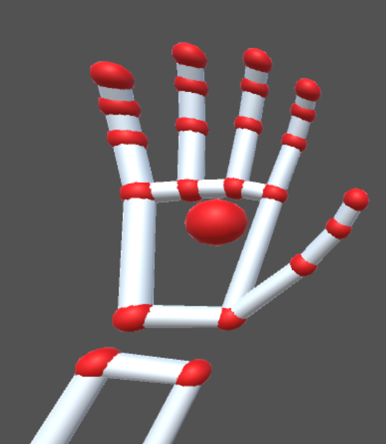
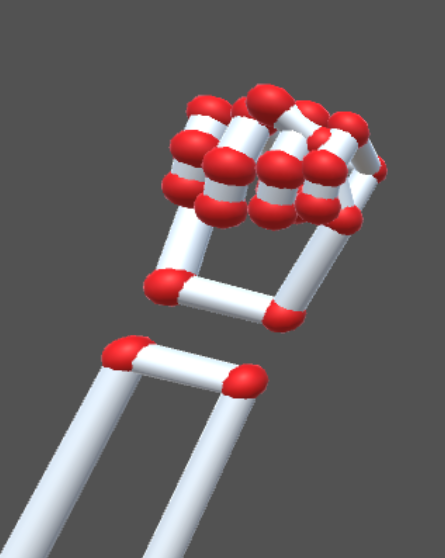
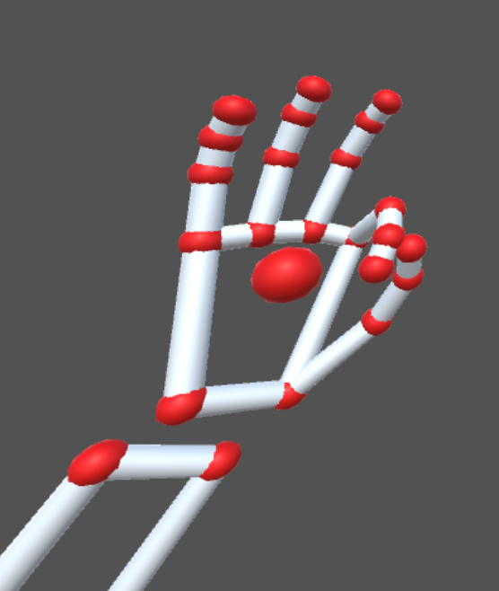
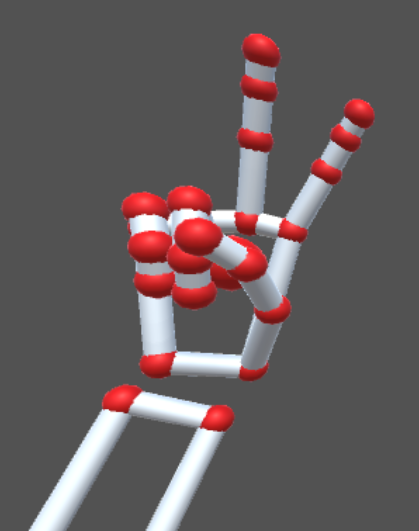
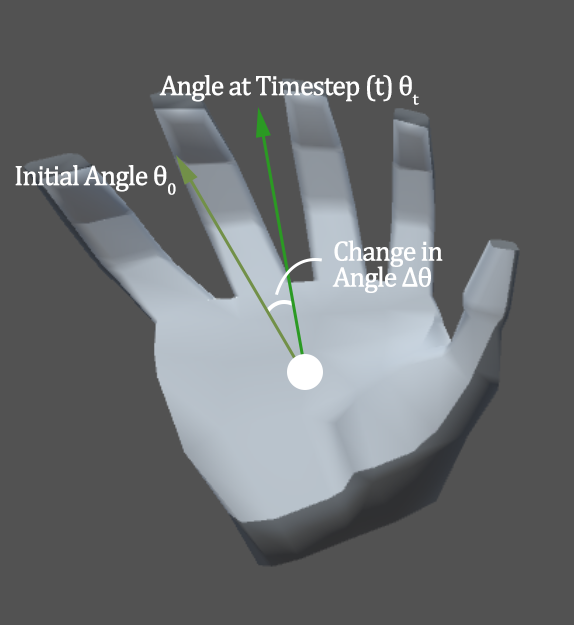
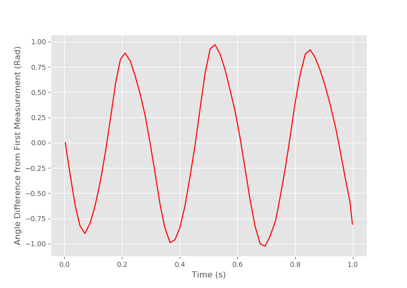

# Human Robot Interaction

# Hand Gestures

Hand gestures are used to set the robot's different 'modes' for positioning and scanning the workpiece grooves. A Leap Motion Controller developed by the Ultraleap company are leveraged in order to detect such gestures.

The Leap Motion controller makes use of infrared cameras and software algorithms to tracked hands' skeletal models providing detailed information on the pose of every bone and joint in the hand, as well as additional data such has the hand being left/right and whether a finger is extended. Using this data collected over time, we are able to recognize both static and dynamic gestures. 

## Static Gestures

By analyzing the hand's pose at one instant, static gestures can be identified based on specified conditions.

### Hand open

All fingers extended.




### Hand Closed

All fingers retracted.




### OK Sign

Thumb and index finger retracted and distance is smaller than 30mm. Middle, ring, pinky finger extended




### Peace Sign

Middle and index finger extended and distance is smaller than 30mm. Thumb, ring, pinky finger retracted.



## Dynamic Gestures

By tracking the hand's pose over time, dynamic gestures can be recognized as well.

### Hand wave

The hand's direction vector, i.e. the direction from palm to fingers, projected to the Leap Motion Controller's XY plane can be tracked over time and represented as a changing angle relative to an arbitrary initial angle.



When plotted, it looks like the following:



A hand wave can then be characterized as a high amplitude and high frequency signal derived from the hand direction's changing angle.

```python
time_series_hand_poses = collect_hand_tracking_data()
time_series_hand_angles = calculate_hand_angles(time_series_hand_poses)
plot(time_series_hand_angles)
signal_frequency, singal_amplitude = signal_analysis(time_series_hand_angles)
if (
    signal_freqency > detection_threshold_1
    and signal_amplitude > detection_threshold_2
):
    hand_wave_detected = True

```

# Robot Tracking algorithm

The previously discussed hand gestures are used to set the following robot tracking modes.

## Interaction Workflow

1. Robot is stopped
   1. Wave to the Leap Motion sensor to enable 'positioning' mode
   2. 'Positioning' mode is a fast 1 DOF (yaw) robot control mode that tracks your palm position and normal and is used to quickly position the robot close to the groove to be welded
2. Robot is positioning
   1. Make a peace sign to start '2DOF mode'
   2. '2DOF' mode is a slower 2 DOF (yaw & pitch) robot that tracks your palm position, normal and fingers' direction to accurately maneuver the robot to scan a 3D point cloud of the groove.
3. Robot is positioning in 2DOF
   1. When you want to start recording the position & orientation of the tool,make an OK sign
4. Robot is in scanning mode
   1. Also 2DOF tracking
   2. When you want to stop scanning, close your hand into a fist. The scanning results will be written to an excel file.

The pseudo-code for the robot tracking algorithm is as follows:

**IEEE**


```
------------------------------------
Algorithm: UR3 Arm Hand Tracking
------------------------------------
Inputs: 
    Robot Pose: P_Robot
    Leap Motion Camera Pose wrt. Robot Wrist: P_LM
    Hand Pose (Relative to Leap Motion): P_Hand_Relative
Output:
    New Robot Pose: P'_Robot
1. While 1:
2.     Compute Transformation Matrix (T) from P_Robot and P_LM
3.     Calculate the Absolute Hand Pose wrt. Robot Base (P_Hand_Absolute) using T
4.     Calculate a basis (B_Hand) based on P_Hand_Absolute
5.     Calculate the new wanted basis of the robot (B_New_Robot) rotated 180 Degrees about its Z 'looking back' at B_Hand
6.     Calculate a rotation vector (RotVec_New_robot) from B_New_Robot
7.     Calculate the new position of the robot (Pos_New_Robot) by projecting a distance (D) along the Y-vector of the hand basis (i.e.: the vector out the palm)
8.     Derive New Robot Pose: P'_Robot by combining Pos_New_Robot and 8RotVec_New_robot
9.     Send a move instruction to the UR3 arm with the new robot pose P'_Robot
10. End While

```

**Python**

```python
# Measure the pose (position & orientation) of the hand relative to the Leap Motion Controller
relative_hand_pose = get_hand_pose()

# Retrieve the pose of the UR3 arm and use it to transform the relative position of the hand into the absolute coordinate frame of the UR3 Arm
robot_pose = get_robot_pose()
absolute_hand_pose = get_absolute_hand_pose(robot_pose, relative_hand_pose)

# Define a basis/coordinate system based on the hand
# Z-Axis: Direction of fingers from palm
# Y-axis: Direction of palm normal
# X-axis: Direction of palm to pinky
hand_basis = calculate_coordinate_system(absolute_hand_pose)

# Derive a wanted basis of the robot mirroring the hand basis
wanted_robot_basis = calculate_wanted_basis(absolute_hand_pose, robot_tracking_mode)

# Convert the wanted basis into a roation vector
wanted_robot_rotation_vector = calculate_rotation_vector(wanted_robot_basis)

# Calculate the wanted position of the robot a set distance from the Y-component of the hand basis, i.e. the vector pointing out from the palm.
wanted_robot_position = calculate_wanted_robot_position(absolute_hand_pose, robot_hand_distance)

# Send the a move instruction encoding the rotation vector and new position to the UR robot
move_robot(wanted_robot_position, wanted_robot_position)
```

The `calculate_wanted_basis()` function calculates the basis based on on the robot tracking mode and modifies the basis matrix to achieve 1 or 2 degrees of freedom by setting certain columns, rows, or elements to zero or one.


